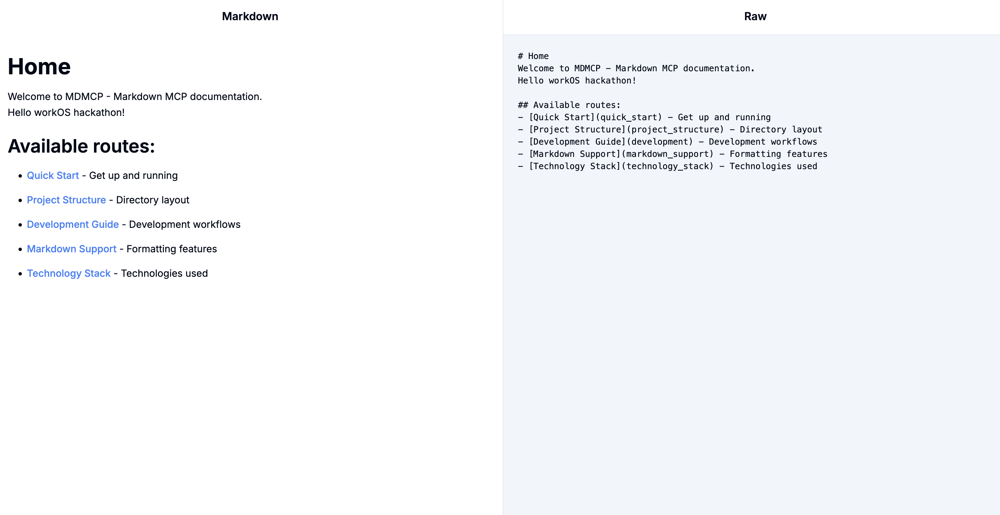
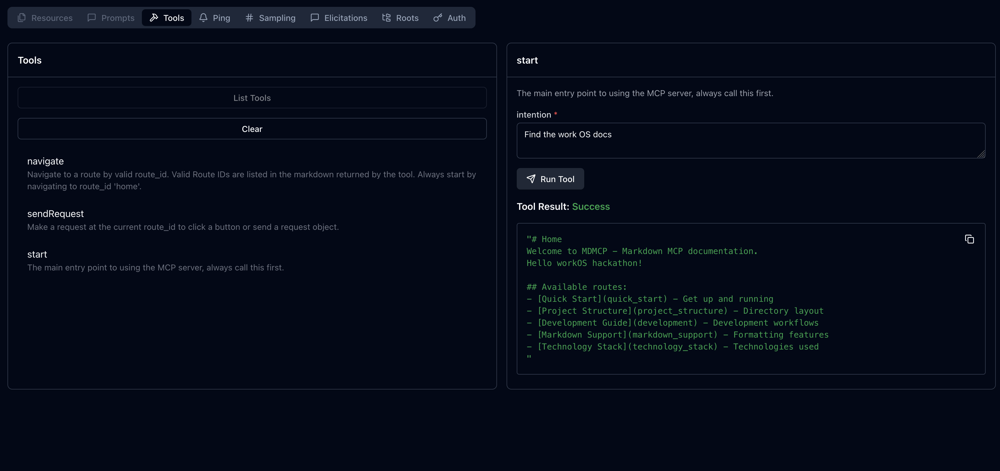

# MDMCP - Markdown MCP
Markdown MCP is a more accurate, token efficient framework for building an MCP server 




A unified monorepo containing both a Next.js frontend application and an MCP (Model Context Protocol) server for serving markdown text.
This project provides a complete solution for rendering and serving markdown content with dynamic template support and a modern web interface.

## 🚀 Quick Start

### Prerequisites

- Node.js >= 18.0.0
- npm (comes with Node.js)
- Git

### Installation

1. **Clone the repository:**
   ```bash
   git clone <repository-url>
   cd modelmarkdownprotocol
   ```

2. **Install frontend dependencies:**
   ```bash
   cd frontend && npm install
   ```

3. **Install MCP server dependencies:**
   ```bash
   cd mcp && npm install
   ```

4. **Install at the project root and start development servers:**
   ```bash
   npm install && npm run dev
   ```

This will start both the frontend (Next.js) and MCP server concurrently. The frontend will be available at `http://localhost:3000` and the MCP server will run on its configured port.

## 📦 Installation as Package

```bash
npm install mdmcp
```

### CLI Usage

After installing globally or using npx:

```bash
# Start MCP server
mdmcp-server

# Start Next.js frontend server
mdmcp-frontend
```

## 🏗️ Project Structure

```
mdmcp/
├── frontend/                    # Next.js frontend application
│   ├── app/                    # Next.js App Router pages
│   │   ├── layout.tsx         # Root layout component
│   │   ├── page.tsx           # Home page
│   │   ├── ClientRouter.tsx   # Client-side routing
│   │   └── [...slug]/         # Dynamic routing
│   ├── src/                   # Source code
│   │   ├── components/        # Reusable UI components
│   │   │   └── ui/           # Radix UI components
│   │   └── utils/            # Utility functions
│   ├── styles/               # Global styles
│   ├── package.json          # Frontend dependencies
│   ├── next.config.js        # Next.js configuration
│   ├── tailwind.config.js    # Tailwind CSS configuration
│   └── tsconfig.json         # TypeScript configuration
├── mcp/                       # MCP server implementation
│   ├── index.ts              # Main server entry point
│   ├── sessions.ts           # Session management
│   ├── tools/                # MCP tools
│   │   ├── navigate.ts       # Navigation tool
│   │   ├── startHere.ts      # Start here tool
│   │   └── sendRequest.ts    # Request sending tool
│   ├── utils/                # Server utilities
│   ├── package.json          # MCP server dependencies
│   └── tsconfig.json         # TypeScript configuration
├── md/                        # Markdown content and conversion
│   ├── _generated/           # Auto-generated markdown files
│   ├── converter.ts          # Markdown ↔ TypeScript converter
│   ├── convert-all.ts        # Batch conversion script
│   ├── convert-single.ts     # Single file conversion
│   └── *.md                  # Source markdown files
├── dist/                      # Built output (generated)
├── package.json              # Root package configuration
├── tsconfig.json             # Root TypeScript configuration
└── README.md
```

## 🛠️ Development

### Available Scripts

| Script | Description |
|--------|-------------|
| `npm run dev` | Start both frontend and MCP server in development mode |
| `npm run dev:frontend` | Start only the Next.js frontend |
| `npm run dev:mcp` | Start only the MCP server |
| `npm run build` | Build both services for production |
| `npm run build:frontend` | Build only the frontend |
| `npm run build:mcp` | Build only the MCP server |
| `npm run start` | Start the frontend in production mode |
| `npm run start:frontend` | Start the Next.js frontend |
| `npm run start:mcp` | Start the MCP server |
| `npm run clean` | Clean all build outputs and dependencies |
| `npm run install:all` | Install dependencies for all packages |
| `npm run generate` | Convert all TypeScript files to markdown |
| `npm run generate:single` | Convert a single file |
| `npm run watch:md` | Watch markdown files for changes |

### Development Workflow

1. **Frontend Development:**
   ```bash
   cd frontend
   npm run dev
   ```
   - Runs on `http://localhost:3000`
   - Hot reload enabled
   - TypeScript type checking

2. **MCP Server Development:**
   ```bash
   cd mcp
   npm run dev
   ```
   - Uses `tsx` for TypeScript execution
   - Auto-restart on file changes

3. **Markdown Content Development:**
   ```bash
   # Watch for markdown changes
   npm run watch:md

   # Generate all markdown files
   npm run generate
   ```

## 📝 Markdown Support & Formatting

MDMCP supports rich markdown formatting with advanced features:

### Standard Markdown

- **Headers:** `# H1`, `## H2`, `### H3`, etc.
- **Emphasis:** `*italic*`, `**bold**`, `***bold italic***`
- **Lists:** Ordered (`1.`) and unordered (`-`, `*`)
- **Links:** `[text](route_id)`
- **Images:** ``
- **Code:** `` `inline` `` and ``` code blocks ```
- **Blockquotes:** `> quote`
- **Tables:** GitHub Flavored Markdown tables
- **Horizontal Rules:** `---`

### Extended Features

#### GitHub Flavored Markdown (GFM)
- **Strikethrough:** `~~deleted text~~`
- **Task Lists:** `- [x] completed` / `- [ ] todo`
- **Tables with alignment**
- **Automatic route_id linking**
- **Line breaks:** Respected without requiring double spaces

#### MDX Support
- **React Components:** Embed React components in markdown
- **JSX:** Use JSX syntax within markdown
- **Imports:** Import and use components

#### Code Syntax Highlighting
Supports syntax highlighting for:
- JavaScript/TypeScript
- HTML/CSS
- JSON
- Bash/Shell
- Python
- And many more languages

#### Template Variables
Dynamic content with template variables:
```markdown
Hello {{name}}, welcome to {{project}}!
```

Converted to TypeScript functions:
```typescript
export function template({name, project}: {name: string, project: string}): string {
  return `Hello ${name}, welcome to ${project}!`;
}
```

### Markdown Conversion System

The project includes a sophisticated markdown ↔ TypeScript conversion system:

#### TypeScript to Markdown
- Extracts template literals from TypeScript exports
- Handles escaped backticks properly
- Maintains formatting and structure

#### Markdown to TypeScript
- Converts markdown to TypeScript template functions
- Automatically detects template variables (`{{variable}}`)
- Generates type-safe functions for templated content
- Creates constant exports for static content

#### Usage Examples

**Convert markdown to TypeScript:**
```bash
npm run generate:single -- path/to/file.md
```

**Convert TypeScript to markdown:**
```bash
npm run generate:single -- path/to/file.ts
```

**Batch conversion:**
```bash
npm run generate
```

## 🏭 Production

### Building for Production

```bash
# Build everything
npm run build

# Or build individually
npm run build:frontend
npm run build:mcp
```

### Production Deployment

1. **Frontend (Next.js):**
   ```bash
   npm run start:frontend
   ```

2. **MCP Server:**
   ```bash
   npm run start:mcp
   ```

3. **Using built binaries:**
   ```bash
   # After npm pack and install
   mdmcp-frontend
   mdmcp-server
   ```

## 🧩 Technology Stack

### Frontend Technologies
- **Next.js 15** - React framework with App Router
- **React 18** - UI library with latest features
- **TypeScript 5+** - Type safety and developer experience
- **Tailwind CSS** - Utility-first CSS framework
- **Radix UI** - Unstyled, accessible UI components
- **MDX** - Markdown with JSX support
- **React Markdown** - Markdown rendering with custom components
- **Remark GFM** - GitHub Flavored Markdown support
- **Lucide React** - Icon library

### Backend Technologies
- **Model Context Protocol SDK** - MCP server implementation
- **Express.js 5** - Web application framework
- **TypeScript** - Type-safe server development
- **Zod** - Runtime type validation
- **Node.js 18+** - JavaScript runtime

### Development Tools
- **tsx** - TypeScript execution for Node.js
- **Concurrently** - Run multiple commands simultaneously
- **Chokidar** - File watching for development
- **ESLint** - Code linting
- **Autoprefixer** - CSS vendor prefixing

## 🔧 Configuration

### Environment Variables

Create `.env.local` in the frontend directory:
```env
# Add your environment variables here
NEXT_PUBLIC_API_URL=http://localhost:8080
```

### TypeScript Configuration

The project uses a monorepo TypeScript setup with:
- Root `tsconfig.json` for shared configuration
- Frontend-specific TypeScript configuration
- MCP server-specific TypeScript configuration

### Tailwind CSS

Fully configured with:
- Custom color scheme
- Responsive design utilities
- Component variants
- Animation support

## 🤝 Contributing

1. Fork the repository
2. Create a feature branch: `git checkout -b feature/amazing-feature`
3. Make your changes
4. Run tests: `npm test`
5. Commit your changes: `git commit -m 'Add amazing feature'`
6. Push to the branch: `git push origin feature/amazing-feature`
7. Open a Pull Request

## 📄 License

MIT License - see LICENSE file for details

## 🆘 Support

- **Issues:** Report bugs and request features on GitHub Issues
- **Documentation:** Comprehensive docs available in the codebase
- **Community:** Join discussions in GitHub Discussions

---

Built with ❤️ using Next.js, TypeScript, and the Model Context Protocol